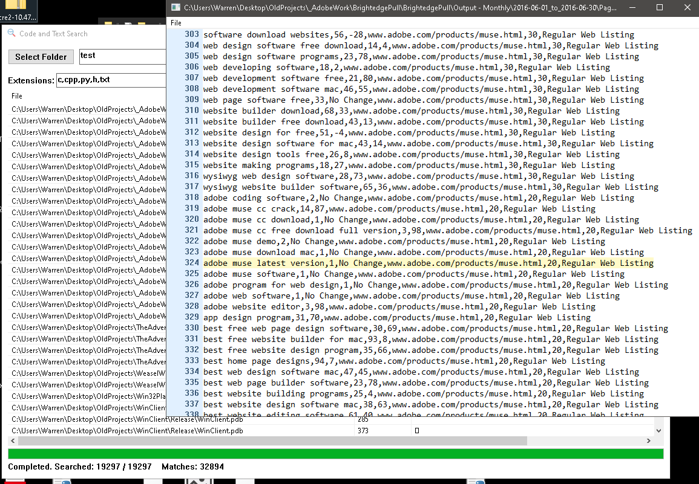

# FastSearch: High‑Performance Code & Text Search with Regex for Windows

FastSearch is a native Win32 desktop application written in C++ designed for fast, multi‑threaded searching across large codebases and text repositories with full Regular Expression (Regex) support. 

By leveraging memory‑mapped I/O, SIMD‑accelerated substring search (AVX2), and a parallel worker thread pool, FastSearch delivers real‑time results with maximum speed and minimal overhead. It is built specifically for developers, power users, and anyone needing to search through millions of lines of text instantly.
<br>


## Features

* **Blazing‑Fast Plain‑Text Search** – Instantly scan massive volumes of text.
* **AVX2‑Accelerated Substring Scanning** – High-performance hardware-level text processing.
* **PCRE2 JIT-Compiled Regular Expression Search** – Just-In-Time compiled regex for maximum speed.
* **Memory‑Mapped File I/O** – Reads files directly from memory to eliminate redundant copying overhead.
* **Multi‑Threaded Worker Pool** – Concurrent processing of files across all available CPU cores.
* **Full Unicode Support** – Built-in compatibility with UTF‑8 and Unicode Character Properties (UCP).
* **Built‑in Code/Text Viewer** – Inspect search matches directly inside the application.
* **CSV Export** – Save your search results seamlessly for external analysis.

## Performance Architecture

### Accelerated Search
Plain‑text search utilizes a custom AVX2 routine to detect candidate matches rapidly before verifying them efficiently with `memcmp`.

### Memory‑Mapped File I/O
Files are mapped directly into the application's virtual address space, allowing the operating system to handle file caching and data retrieval without extra buffers.

### Threading Model
A designated pool of worker threads processes multiple files concurrently to ensure maximum utilization of modern multi-core processors.


## Build Options

SIMD optimizations can be pushed further by utilizing the compiler flag `-mavx2`. Note that the resulting output binary will be strictly optimized for your specific CPU architecture.

### Building with PCRE2 (Regex Support)
FastSearch can optionally include the PCRE2 library for full regular expression support. 

To enable this feature, define the following preprocessor macro:
```text
-DUSE_PCRE2
```

Then, compile and link the following PCRE2 source files into your project:
```text
pcre2_auto_possess.c
pcre2_chartables.c
pcre2_compile.c
pcre2_config.c
pcre2_context.c
pcre2_error.c
pcre2_extuni.c
pcre2_find_bracket.c
pcre2_match.c
pcre2_match_data.c
pcre2_newline.c
pcre2_ord2utf.c
pcre2_pattern_info.c
pcre2_script_run.c
pcre2_string_utils.c
pcre2_study.c
pcre2_tables.c
pcre2_ucd.c
pcre2_valid_utf.c
pcre2_xclass.c
```

## ⚖️ PCRE2 Attribution

FastSearch includes optional integration with PCRE2, which is:
* **PCRE2** – Perl Compatible Regular Expressions (Version 2)  
* **Copyright** – © University of Cambridge  
* **License** – BSD 3‑Clause License  
https://www.pcre.org/
